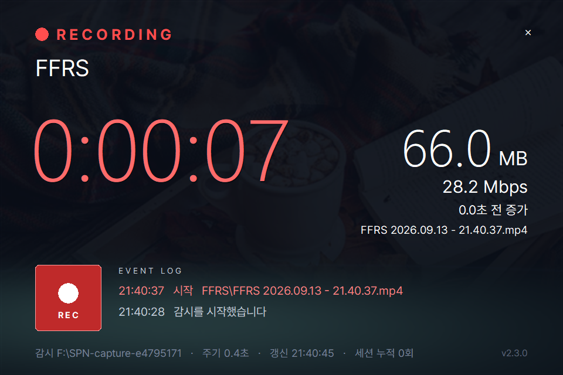
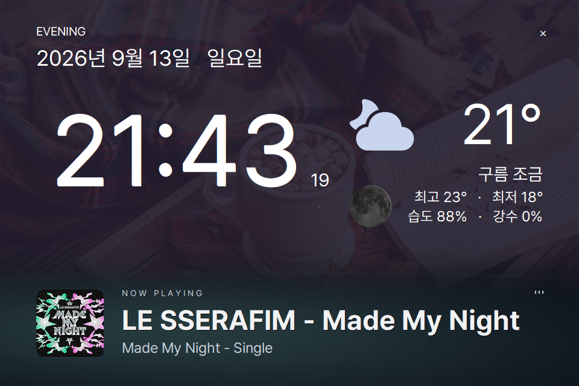

# 🎬 ShadowPlay Notifier

[](https://github.com/deuxdoom/Shadowplay-Notifier/releases/latest)
[](https://github.com/deuxdoom/Shadowplay-Notifier/releases/latest)
[](https://github.com/deuxdoom/Shadowplay-Notifier/releases)
[](LICENSE)  
[](https://github.com/deuxdoom/Shadowplay-Notifier)
[](https://www.python.org/)
[](https://docs.python.org/3/library/tkinter.html)
[](https://www.nvidia.com/geforce/nvidia-app/)





[](https://deuxdoom.github.io/Shadowplay-Notifier/)

화면과 기능을 한자리에 모아 둔 **[소개 페이지](https://deuxdoom.github.io/Shadowplay-Notifier/)** 도 있습니다.

---

## 📌 간단 소개

- **ShadowPlay Notifier**는 NVIDIA ShadowPlay(NVIDIA App)의 **녹화 상태를 보조
  모니터에 크게 표시**해 주는 Windows 앱입니다.
- NVIDIA App 의 녹화 상태 아이콘이 영상에 그대로 찍히는 것이 싫어서 그 표시를
  꺼 두면, 정작 녹화가 돌아가고 있는지 알 길이 없어집니다. 이 앱은 그 자리를
  대신합니다.
- 녹화 폴더를 지켜보면서 파일이 커지는지, 파일이 쓰기로 열려 있는지를 보고
  판단합니다. **녹화 프로그램에 끼어들지 않고 폴더를 읽기만 하므로** 어떤 녹화
  도구를 쓰든 동작하며, 녹화 결과물에는 손대지 않습니다.
- 녹화를 기다리는 동안에는 **시계와 날씨, 지금 듣는 음악을 보여 주는 월페이퍼
  화면**이 됩니다. 녹화가 시작되면 곧바로 녹화 화면으로 바뀌고, 끝나면 다시
  돌아옵니다. 보조 모니터를 늘 켜 두어도 화면이 비어 있지 않습니다.
- 별도의 설치 과정이 없고 Python 도 필요하지 않습니다. 실행 파일 하나로 씁니다.

---

## ✨ 주요 기능

- 🔴 **녹화 상태 표시** — 녹화가 시작되면 화면이 붉은 표시와 큰 경과 시간으로
  바뀝니다. 표시등은 어두워지는 대신 더 밝은 쪽으로 깜박이고 크기가 함께 커져서,
  멀리서 보아도 켜져 있는지 헷갈리지 않습니다.
- 📊 **녹화 정보 확인** — 저장 폴더, 파일 이름, 경과 시간, 용량, 비트레이트,
  마지막으로 파일이 커진 시각을 보여 줍니다.
- 🔄 **이어지는 화면 전환** — 녹화 화면과 월페이퍼가 같은 계절 사진과 골격을
  씁니다. 시계가 있던 자리에 경과 시간이, 기온이 있던 자리에 용량이 들어가므로
  녹화가 시작되어도 화면이 통째로 갈리지 않습니다. 녹화 중에는 사진의 조명을
  낮추어 붉은 표시가 묻히지 않게 합니다.
- ⚡ **빠른 반응** — 파일이 쓰기로 열려 있는지를 함께 보므로, 녹화를 시작하거나
  멈추면 폴링 주기 한 번 안에 화면에 반영됩니다.
- 🖥️ **보조 모니터 지원** — 기본 960×640 화면이며, 창 크기와 같은 모니터를
  자동으로 찾아 그 자리에 띄웁니다. 전체화면으로 바꾸면 글자와 정보 영역이
  해상도에 맞춰 함께 커집니다.
- ⚙️ **간편 설정** — 감시 폴더, 표시할 모니터, 항상 위에 표시, 알림음을 창에서
  바로 바꿀 수 있습니다.
- 🕒 **월페이퍼 화면** — 녹화를 기다리는 동안 큰 시계와 날짜, 요일, 날씨를
  보여 줍니다. 기온과 날씨 아이콘, 오늘 최고·최저 기온, 습도, 강수 확률이
  함께 나옵니다. 960×640에서도 잘 읽히도록 날짜와 날씨를 크게 표시하고,
  날씨 아이콘에는 느린 움직임을 더했습니다. 시계와 초, 기온은 Pretendard로
  통일했습니다. 시계는 날짜와 왼쪽을 맞춰 더 크게 표시하며, 시·분 사이 콜론만
  깜빡입니다. 초는 계속 표시하면서 숫자만 바뀝니다. 오른쪽 아래에는 버전이 나옵니다.
- 🎵 **재생 중인 음악** — Spotify 에서 듣고 있는 곡과 아티스트, 앨범 커버를
  보여 줍니다. 로그인이나 계정 연결이 필요 없습니다. iTunes 와 Deezer 결과의
  곡명과 아티스트가 실제 재생 정보와 맞는지 확인한 뒤 커버를 쓰며, 검색에 없는
  신곡만 곡 전환 직후 생긴 Spotify 캐시가 하나로 명확할 때 보완합니다.
- 📈 **소리에 맞춰 움직이는 파형** — 스피커로 나가는 소리를 12개 주파수
  대역으로 나누어, 지평선의 완만한 곡선을 따라 서는 64개의 무지개색 막대와
  옅은 반사로 그립니다. 소리를 녹음하거나 저장하지 않고 세기만 잽니다. 소리가
  멈추면 파형도 조용히 가라앉습니다.
- 🌙 **오늘 달** — 날씨 아래에 지금 달이 뜹니다. 실제 달 사진에 그날의 그늘을
  덮어 그리므로 초승달인지 보름달인지 한눈에 알 수 있습니다. 사진은 환하게
  보정하고 그림자는 옅게 해 작은 화면에서도 달의 윤곽과 표면 무늬가 보입니다.
- 🌸 **사계절 사진 월페이퍼** — 봄(3~5월)은 벚꽃 가지, 여름(6~8월)은 야자수가
  늘어선 바다, 가을(9~11월)은 담요 위에 놓인 코코아와 펼친 책, 겨울(12~2월)은
  서리가 피어난 얼음 구슬입니다. 달력의 계절을 자동으로 따라가며, 사진은 EXE에
  포함되어 인터넷 연결이 없어도 표시됩니다. 계절 이름은 따로 띄우지 않고
  계절이 바뀌면 배경 사진이 조용히 달라집니다.
- 🌤️ **시간대마다 달라지는 색** — 심야와 새벽에는 어두운 남색, 오전에는 낮은
  해의 금빛, 낮에는 맑고 환한 빛, 오후에는 노을이 물드는 금빛, 저녁에는
  어스름한 보랏빛입니다. 낮은 정오부터 오후 4시 무렵까지 이어지고 저녁 8시에
  어스름이 내립니다. 색과 농도를 화면 전체에 똑같이 입히므로 얼룩이 지지
  않으며, 화면 왼쪽 위에는 시간대 이름만 적습니다.
- 🌧️ **잠깐씩 찾아오는 날씨 연출** — 비 오는 날에는 유리 위를 미끄러지는
  물방울, 눈 오는 날에는 느린 눈송이, 맑은 밤에는 유성이 나타났다가 사라집니다.
  배경이 밝으면 짙게, 어두우면 환하게 칠해 어느 시간대에도 눈에 들어옵니다.
- 🔍 **어떤 사진 위에서도 읽히는 글자** — 시계와 날짜, 날씨, 녹화 정보, 오른쪽
  위 버튼이 저마다 자기가 놓인 자리의 배경 밝기를 재어 흰색과 검정 가운데 더
  잘 보이는 쪽으로 칠해집니다. 앨범 커버에서 뽑은 색은 하단 커버 옆에서
  오른쪽으로 넓게 번지고, 음악이 없을 때는 레코드 문양과 ‘고요한 순간’ 화면으로
  쉬어 갑니다.
- 🔆 **트레이에서 계속 실행** — X를 누르면 알림 영역으로 이동합니다. 트레이에서
  창을 다시 열고, 환경설정과 GitHub 페이지를 열거나 프로그램을 종료할 수
  있습니다. 창을 숨기면 월페이퍼 렌더링과 음악·날씨 조회를 쉬고 녹화 감시는
  계속합니다.
- 🚀 **윈도우 시작 시 실행** — 트레이 아이콘을 오른쪽 클릭해 `윈도우 시작 시 실행`을
  체크하면 다음 로그인부터 자동으로 실행됩니다. 다시 누르면 해제됩니다.

---

## 📦 설치 및 실행

1. [Releases](https://github.com/deuxdoom/Shadowplay-Notifier/releases/latest)에서
   `ShadowPlayNotifier.exe` 를 내려받아 원하는 폴더에 둡니다.
2. 내려받은 파일을 그대로 실행합니다. 압축을 풀 필요도, 설치 과정도 없습니다.
3. 오른쪽 위 **⚙️ 환경설정**에서 NVIDIA App 의 동영상 저장 폴더를 지정하고
   저장합니다.

**Windows 10 이상**에서 사용하며, Python 을 따로 설치할 필요가 없습니다.
설정과 기록은 실행 파일 옆에 `config.json` 과 `monitor.log` 로 남으므로,
쓰기가 되는 폴더에 두십시오.

---

## 🖱️ 기본 조작

| 동작 | 방법 |
| --- | --- |
| 창 이동 | 창의 아무 곳이나 마우스로 끌기 |
| 전체화면 | 오른쪽 위 전체화면 버튼 또는 `F11` |
| 전체화면 해제 | 전체화면에서 `Esc` |
| 트레이로 이동 | 오른쪽 위 `✕` 버튼 또는 일반 창에서 `Esc` |
| 창 복원 | 트레이 아이콘 클릭 또는 프로그램 다시 실행 |
| 프로그램 종료 | 트레이 우클릭 → 프로그램 종료, 또는 `Ctrl+Q` |

키보드 단축키는 창을 한 번 클릭한 뒤에 씁니다. 타이틀바가 없는 창이라 초점을
자동으로 받지 못하기 때문입니다.
월페이퍼의 X 버튼은 항상 보입니다. 마우스를 움직이면 환경설정·전체화면 버튼도
나타납니다. 평소에는 월페이퍼를 보여 주고, 녹화가 감지된 동안에만 녹화 화면으로
자동 전환한 뒤 녹화가 끝나면 월페이퍼로 돌아옵니다.

---

## ⚙️ 설정

환경설정 창에서 바꾼 값은 실행 파일 옆의 `config.json`에 저장되고 곧바로
적용됩니다. 앱을 껐다 켤 필요가 없습니다.

| 항목 | 설명 |
| --- | --- |
| 녹화 폴더 | 녹화 중에 파일이 커지는 폴더입니다. 하위 폴더까지 함께 봅니다. |
| 폴링 주기 | 폴더를 훑어보는 간격입니다. 기본 0.5초입니다. |
| 중단 판정 시간 | 파일이 커지지 않은 채 이만큼 지나면 녹화가 끝난 것으로 봅니다. |
| 표시할 모니터 | `-1`이면 창 크기와 같은 해상도의 모니터를 자동으로 고릅니다. |
| 항상 위 · 테두리 없음 · 소리 | 게임 녹화에 소리가 섞이면 안 되므로 알림음은 기본 꺼짐입니다. |
| `latitude` · `longitude` | 날씨를 볼 곳입니다. 기본값은 서울(37.5665, 126.978)입니다. |
| `verbose_log` | 자세한 기록을 남길지 정합니다. 문제를 찾을 때만 `true` 로 켜십시오. |

날씨는 [Open-Meteo](https://open-meteo.com/) 에서 받아 오며 API 키가 필요 없습니다.
네트워크가 없거나 조회에 실패해도 시계와 음악은 그대로 나옵니다.

녹화 기록과 오류는 `monitor.log`에 남습니다. 무엇이 잘못되었는지 눈에 띄도록
녹화와 오류만 적으며, 더 자세히 보려면 `verbose_log` 를 켜십시오. 녹화가
감지되지 않으면 먼저 녹화 폴더 경로부터 확인하십시오.

---

## 📜 라이선스

이 프로젝트는 **MIT 라이선스**를 따릅니다. 전문은 [LICENSE](LICENSE)에 있습니다.

```
Copyright (c) 2026 deuxdoom
```

배너와 날씨에 쓰는 아이콘은 Microsoft 의
[Fluent UI System Icons](https://github.com/microsoft/fluentui-system-icons)에서
가져왔으며, 이 역시 MIT 라이선스입니다.

날씨 옆에 띄우는 달은 실제 달 사진에 그날의 그늘을 덮어 그립니다.

사계절 사진은 [Unsplash](https://unsplash.com/) 에서 가져왔으며
[Unsplash License](https://unsplash.com/license)를 따릅니다. 사진을 갈아 끼우는
방법은 [사진 출처](assets/wallpapers/README.md)에 적어 두었습니다.

앱에 포함한 글꼴은 [Pretendard](https://github.com/orioncactus/pretendard)입니다.
소개 페이지에는 [JetBrains Mono](https://github.com/JetBrains/JetBrainsMono)도 씁니다.
둘 다 SIL Open Font License 1.1을 따릅니다. 앱 글꼴은 프로그램이 돌아가는 동안에만
등록되고 윈도우에 설치되지 않습니다.
